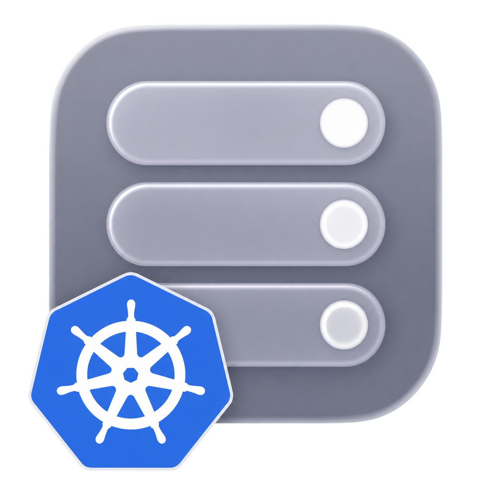

# container-k8s

<!-- markdownlint-disable MD013 MD033 -->
<p>
  
  <a href="https://github.com/stephenlclarke/container-k8s/actions/workflows/ci.yml?query=branch%3Amain"></a>
  <a href="https://github.com/stephenlclarke/container-k8s/actions/workflows/codeql.yml?query=branch%3Amain"></a>
  <a href="https://github.com/stephenlclarke/container-k8s/actions/workflows/homebrew.yml?query=branch%3Amain"></a>
  <a href="https://github.com/stephenlclarke/container-k8s/actions/workflows/prebuilt-binaries.yml?query=branch%3Amain"></a>
  <a href="https://sonarcloud.io/summary/new_code?id=stephenlclarke_container-k8s"></a>
  <a href="https://sonarcloud.io/summary/new_code?id=stephenlclarke_container-k8s"></a>
  <a href="https://sonarcloud.io/summary/new_code?id=stephenlclarke_container-k8s"></a>
  <a href="https://sonarcloud.io/summary/new_code?id=stephenlclarke_container-k8s"></a>
  <a href="https://sonarcloud.io/summary/new_code?id=stephenlclarke_container-k8s"></a>
  <a href="https://sonarcloud.io/summary/new_code?id=stephenlclarke_container-k8s"></a>
  <a href="https://sonarcloud.io/summary/new_code?id=stephenlclarke_container-k8s"></a>
  <a href="https://sonarcloud.io/summary/new_code?id=stephenlclarke_container-k8s"></a>
  
</p>
<br clear="left" />
<br>
<!-- markdownlint-enable MD033 -->

`container-k8s` is a standalone plugin scaffold for Kubernetes development cluster workflows on Apple's [`container`](https://github.com/apple/container) CLI. The project tracks the [`container k8s` feature discussion](https://github.com/apple/container/discussions/1673): local Kubernetes clusters implemented with k3s node containers, kubeconfig management, local image loading, and a path toward registry-backed development loops.

The repository name and plugin command stay Kubernetes-oriented: `container k8s ...`. k3s is the planned first backend, not the long-term product name.

## Current Status

This repository is at bootstrap stage. It includes the Swift plugin package, command surface, documentation, CI, Homebrew formula scaffolding, and release package automation. Runtime implementation is intentionally tracked in [PLAN.md](PLAN.md) before the first cluster-control code lands.

The initial command surface mirrors the Apple discussion:

```sh
container k8s run my-cluster
container k8s create my-cluster
container k8s list
container k8s load-image my-cluster my-app:latest
container k8s write-config my-cluster
container k8s get-kubeconfig my-cluster
container k8s delete my-cluster
```

## Design Direction

- Use Swift and SwiftPM for the plugin, matching the nearby `container-compose` repository and the language shape of `apple/container`.
- Start with a single-node k3s control-plane cluster that runs directly on Apple container runtime primitives.
- Label all runtime resources with `plugin=k8s` and cluster/node metadata so lifecycle commands are scoped and repeatable.
- Treat kubeconfig edits as a first-class safety boundary: generated contexts must be identifiable, reversible, and scriptable.
- Support `load-image` for the first MVP, while designing registry integration early enough that normal build-tag-push workflows do not become an afterthought.
- Keep CNI and kernel assumptions explicit so add-ons such as Cilium can be evaluated against a known compatibility matrix.

## Documentation

- [DocC API reference](https://stephenlclarke.github.io/api/container-k8s/): browse the generated Swift API reference in the integrated container developer documentation.
- [INSTALL.md](INSTALL.md): install the Homebrew package and register the plugin with `container`.
- [BRANCHES.md](BRANCHES.md): understand active `main` development, semantic package tags, and Homebrew formula policy.
- [BUILD.md](BUILD.md): build, test, package, and run contributor validation.
- [DESIGN.md](DESIGN.md): understand the plugin boundary and planned runtime model.
- [PLAN.md](PLAN.md): review the staged implementation roadmap based on the Apple discussion.
- [STATUS.md](STATUS.md): get the current branch, packaging, and implementation state.
- [CONTRIBUTING.md](CONTRIBUTING.md): prepare focused, reviewable changes.
- [SUPPORT.md](SUPPORT.md): ask for help or report non-security issues.
- [SECURITY.md](SECURITY.md): report security issues.

## License

This project uses the Apache License, Version 2.0, matching the license used by [`apple/container`](https://github.com/apple/container).
